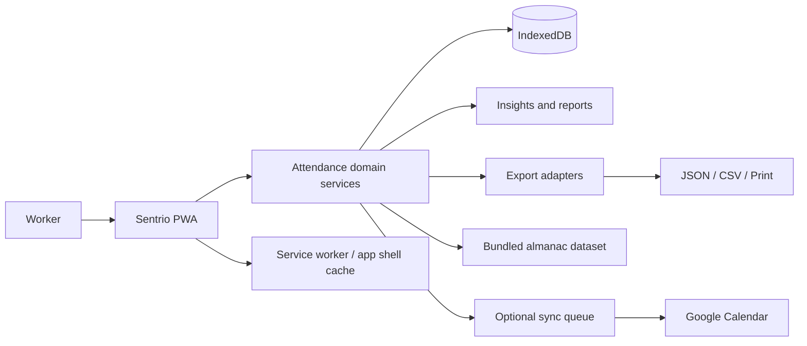
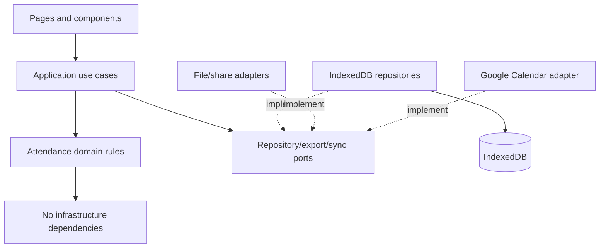
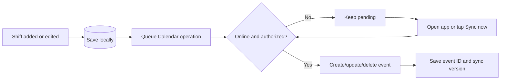

# Sentrio Application Architecture

## 1. Architectural decisions

| Concern | Decision | Reason |
|---|---|---|
| Product scope | Personal self-attendance only | Keeps the app focused and trustworthy |
| Delivery | Installable client-side PWA | Works like an app while retaining one web codebase |
| Offline behavior | Local-first; network is optional | Attendance must never depend on connectivity |
| Domain storage | IndexedDB through typed repositories | Attendance and diary data outgrow synchronous key/value storage |
| UI preferences | `localStorage` only for theme, locale, and onboarding flags | Small non-domain values are safe here |
| Runtime validation | Versioned schemas at form, import, and migration boundaries | TypeScript alone cannot validate imported JSON |
| Date model | Local `YYYY-MM-DD` work dates plus minutes since midnight | Avoids timezone conversion errors in factory schedules |
| Duration model | Integer minutes | Keeps hours and overtime deterministic |
| Historical rules | Snapshot shift inputs into attendance records | Later settings changes cannot rewrite history |
| Backend | None for MVP | Preserves privacy and offline simplicity |
| Google Calendar | Optional one-way adapter | Calendar reminders cannot alter attendance truth |
| Branding | Sentrio only | Avoids implying affiliation with an employer |

## 2. System context



There is no server dependency in MVP. Sentrio remains useful when Google Calendar is disconnected or unavailable.

## 3. Layered design

### Presentation layer

React pages, feature components, forms, navigation, localization, theming, and accessibility. Components render view models and dispatch use cases; they do not calculate attendance statistics or issue raw database queries.

### Application layer

Use cases orchestrate work:

- `markAttendance`
- `startShift`
- `endShift`
- `editAttendance`
- `calculateAttendanceSummary`
- `createBackup`
- `restoreBackup`
- `exportAttendance`
- `queueCalendarSync`
- `disconnectCalendar`

This layer owns transaction boundaries and converts domain errors into user-facing outcomes.

### Domain layer

Pure TypeScript entities, value objects, policies, and calculations. It has no React, browser storage, Google, or formatting dependencies.

Key services:

- `ShiftTimeService`: overnight boundaries and worked minutes
- `AttendanceCycleService`: calendar-month and custom inclusive date ranges
- `OvertimeService`: derived/manual overtime and rounding
- `AttendanceSummaryService`: status counts, hours, shift distribution, and missing dates
- `DiaryStatisticsService`: calendar and reporting-period view models

### Data layer

IndexedDB database definitions, migrations, and repositories. The UI never imports the database instance directly. Repositories expose domain-oriented methods and reactive queries.

### Adapter layer

Output adapters generate JSON backup, CSV, iCalendar, printable reports, and share text. Google Calendar and almanac data are accessed through ports so their implementations can change without changing attendance rules.

## 4. Dependency flow



Dependencies point inward. Domain code must run in unit tests without a browser.

## 5. Recommended source structure

```text
src/
  app/
    App.tsx
    routes.tsx
    providers/
    layout/
  domain/
    attendance/
    shifts/
    attendance-cycles/
    insights/
    almanac/
    shared/
  application/
    ports/
    use-cases/
  data/
    db/
      database.ts
      schema.ts
      migrations/
    repositories/
  features/
    onboarding/
    today/
    diary/
    insights/
    reports/
    settings/
  adapters/
    backup/
    csv/
    print/
    share/
    almanac/
    google-calendar/
  components/
    ui/
    diary/
  i18n/
    en.ts
    mr.ts
  lib/
    date/
    duration/
    validation/
    ids/
  styles/
  test/
```

Feature folders may compose shared domain/application code but must not reach into another feature's private components.

## 6. Persistence architecture

### IndexedDB tables

| Table | Primary indexes | Purpose |
|---|---|---|
| `workProfiles` | `id`, `isActive` | Job-independent diary profiles |
| `shiftConfigs` | `id`, `[profileId+code]` | User-editable shift presets |
| `attendanceCycleConfigs` | `id`, `profileId`, `effectiveFrom` | Calendar-month or custom reporting periods |
| `attendanceRecords` | `id`, `[profileId+workDate]`, `status`, `shiftCode` | One canonical record per profile/day |
| `holidays` | `id`, `[profileId+date]` | User-defined holidays |
| `almanacDays` | `date`, `datasetVersion` | Offline cultural annotations |
| `auditEvents` | `id`, `entityType`, `entityId`, `occurredAt` | Local history for important corrections |
| `calendarConnections` | `id`, `provider`, `calendarId` | Non-secret Calendar connection metadata |
| `calendarEventLinks` | `id`, `attendanceRecordId`, `externalEventId` | Local-to-Google event mapping |
| `syncJobs` | `id`, `provider`, `entityId`, `state`, `nextAttemptAt` | Durable outbound synchronization queue |
| `appMeta` | `key` | Database and seed metadata |

Store only queryable fields as indexes. Schema upgrades are additive where possible and run as versioned migrations.

### Reactive reads

Pages subscribe to repository queries such as the visible diary range or active attendance cycle. Writes go through use cases, after which reactive queries update Today, Diary, Insights, and Reports. Large collections are not duplicated into a global in-memory store.

### Transactions

Use one transaction for operations that must remain consistent:

- ending a shift and updating its attendance record;
- replacing data during a restore;
- merging a backup and recording conflicts;
- saving a record and its outbound Calendar sync job;
- applying an attendance correction and audit event.

## 7. Date and time rules

- `workDate` is a plain local date string, not a UTC timestamp.
- Shift times are stored as integer minutes from local midnight after input parsing.
- An overnight shift has `endMinutes <= startMinutes`; its end occurs on the following local date.
- An attendance record belongs to the date on which its scheduled shift starts.
- `createdAt` and `updatedAt` are UTC instants for audit purposes only.
- Attendance-cycle start and end dates are inclusive.
- For cutoff days that do not exist in a month, clamp to that month's final day and show the resolved date.
- Date arithmetic lives in one tested module; components do not perform manual month math.

## 8. Attendance insights architecture

Insights use a pure calculation pipeline:

```text
Reporting-period dates
  -> attendance records
  -> status counts
  -> worked minutes
  -> overtime minutes
  -> shift distribution
  -> missing/incomplete records
  -> attendance summary
```

The summary service accepts a date range and records, then returns a deterministic `AttendanceSummary`. Today, Insights, Reports, and exports consume the same result so totals cannot diverge. The service never reads storage directly.

Sentrio does not convert time into money and has no salary, wage, allowance, advance, deduction, or statutory-payroll module.

## 9. Backup, restore, and exports

### JSON backup envelope

```ts
interface BackupEnvelope {
  format: 'sentrio-backup';
  schemaVersion: number;
  exportedAt: string;
  appVersion: string;
  data: BackupData;
  checksum: string;
}
```

Restore flow:

1. Parse as untrusted input.
2. Validate the envelope and every record.
3. Verify the checksum.
4. Preview record counts, date range, and conflicts.
5. Ask the user to choose merge or replace.
6. Apply the restore in a transaction.
7. Run integrity checks and report the result.

Exports are generated locally. CSV is the interoperable spreadsheet format for MVP. Printing uses a dedicated report view and `@media print`.

## 10. PWA and offline behavior

- Precache the app shell, fonts, icons, translations, and bundled almanac dataset.
- Domain reads and writes always use the local database, even when online.
- Show an explicit update prompt when a new app shell is ready; never force-reload while a form is being edited.
- Detect private browsing/storage failures and explain that data may not persist.
- Request persistent browser storage when supported, but never treat it as a substitute for backups.
- Reminders are best-effort in a web PWA and must be verified on supported Android devices.

## 11. Google Calendar integration

Google Calendar is optional. The first release uses one-way synchronization from Sentrio to a dedicated secondary calendar named `Sentrio Shifts`.

### Authorization

- Ask only after the user taps `Connect Google Calendar`.
- Request the narrow `calendar.app.created` scope.
- Keep short-lived access tokens in memory, never in IndexedDB, `localStorage`, backups, or logs.
- If authorization expires, retain queued changes and ask the user to tap `Sync now`.
- Unattended background sync requiring refresh tokens is outside the local-only MVP.

### Sync flow



### Event mapping

- Calendar title: `Sentrio Shifts`.
- Event title: localized shift label, for example `Shift A · Morning`.
- Event start/end: scheduled shift time, including next-day end for Shift C.
- Event description: a Sentrio-managed marker and short non-sensitive summary.
- Never include private diary notes.
- Store the returned event ID and ETag against the local record.
- Use a stable private Sentrio identifier to prevent duplicates and support recovery.

### Failure behavior

- Retry transient failures with capped exponential backoff.
- Mark authorization failures as `NEEDS_AUTH` and wait for a user gesture.
- Preserve local edits regardless of Google availability.
- Show compact sync status rather than blocking attendance entry.
- Do not import external Calendar changes into attendance automatically.

## 12. Privacy and security

- Collect no analytics or advertising identifiers by default.
- Keep attendance data on the device unless the user explicitly exports or syncs planned shifts.
- Treat imported backups as untrusted and enforce size, schema, and record-count limits.
- Escape spreadsheet cells beginning with formula-control characters.
- Sanitize user notes before inserting them into printable HTML.
- A simple PIN screen is not encryption.
- Provide clear delete-all-data and backup-first actions.
- Disconnecting Calendar revokes access where possible and asks whether to delete the Sentrio-created calendar.

## 13. Testing strategy

### Unit tests

- all attendance statuses;
- Shift C across midnight;
- leap years and year boundaries;
- 26th–25th and 21st–20th attendance cycles;
- missing cutoff days in short months;
- break and worked-minute calculations;
- overtime thresholds and rounding;
- missing and incomplete records;
- attendance-summary traceability;
- Calendar event boundaries for overnight shifts.

### Repository and migration tests

Run against an IndexedDB-compatible test environment. Every database migration gets a fixture representing the previous version.

### Component and accessibility tests

Test quick attendance entry, keyboard/focus behavior, localized labels, high contrast, and form errors.

### End-to-end tests

Test onboarding through first shift, offline reload, overnight-shift correction, Insights totals, backup round trip, printable export, offline Calendar queuing, reconnection, and duplicate-event prevention.

## 14. Delivery sequence

### Foundation

- Vite/React/TypeScript project and quality tooling
- Tailwind tokens, routing, localization, and PWA shell
- Domain primitives, IndexedDB schema, repositories, and migrations

### Vertical slice 1: daily attendance

- Onboarding and profile setup
- Today quick entry and clock mode
- Offline install/reload verification

### Vertical slice 2: diary and insights

- Calendar-month and custom-cycle diary
- Corrections, notes, overtime time, and audit events
- Status counts, worked hours, overtime hours, and shift distribution

### Vertical slice 3: portability and integration

- Backup/restore
- CSV, print/PDF, and share text
- Optional one-way Google Calendar sync

### Cultural and polish layer

- Marathi copy review
- Licensed almanac datasets
- Suvichar content
- Widgets/reminders where platform support is adequate

## 15. Architecture gates before implementation

Approve executable examples for:

1. The meaning and editing rules of every attendance status.
2. Manual versus clock-derived overtime authority.
3. Overtime threshold and rounding.
4. Cross-midnight edits and missing punches.
5. Attendance-cycle behavior when a cutoff is invalid for a month.
6. Which statuses count toward an optional attendance percentage.
