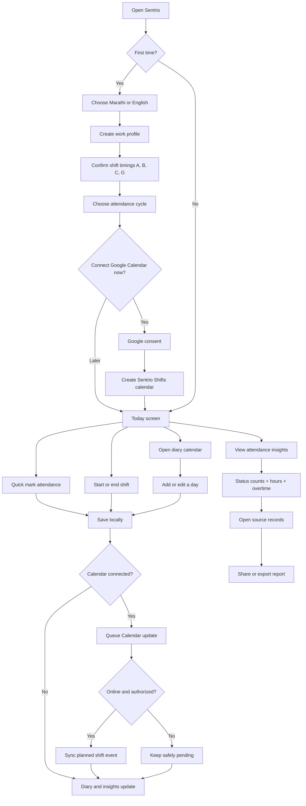
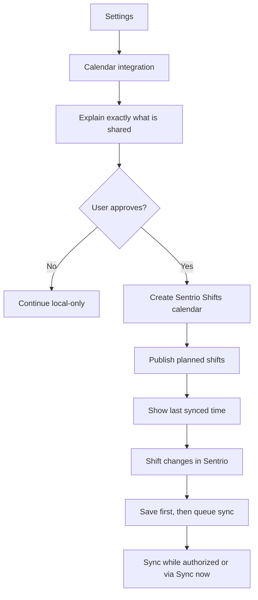

# Sentrio Simple Application Flow

## 1. Full app flow



## 2. Everyday worker flow

The application should feel much smaller than its feature list:

```text
Open app -> See today's shift -> Tap one main action -> Confirm -> Done
```

### Quick attendance

```text
Today -> Mark attendance -> Present/Half day/Leave/etc. -> Save
```

### Clock-based attendance

```text
Today -> Start shift -> optional break -> End shift -> Review hours -> Save
```

### Correction

```text
Diary -> Select date -> Edit shift/status/time/note -> Save
```

### Attendance review

```text
Insights -> Select period -> Status counts -> Worked/overtime hours -> Source records
```

## 3. Navigation model

Use four bottom-navigation destinations and one secondary menu:

1. **Today** — the only daily action screen.
2. **Diary** — calendar history and corrections.
3. **Insights** — attendance totals, hours, overtime, and shift patterns.
4. **Reports** — exports, sharing, and backup.
5. **Settings** — profile, shifts, attendance cycle, Calendar, language, theme, and data tools; opened from the top-right control.

## 4. Google Calendar flow



Google Calendar is a display/reminder destination in the first release. Users edit attendance and shift truth inside Sentrio.

## 5. Professional simplicity rules

- One dominant action per screen.
- Today's shift and status appear before statistics.
- Advanced fields stay behind `More details`.
- Save locally immediately; sync never blocks the user.
- Use plain worker language.
- Every insight can open the records used to calculate it.
- Use consistent colors for shifts, but pair every color with a letter and label.
- Never show advertisements between attendance actions.
- Use Marathi and English copy reviewed by humans.
- Show helpful empty states rather than empty dashboards.
- Ask for Google permission only when the user activates Calendar integration.
- Do not introduce salary or payroll fields.

## 6. Suggested first-run defaults

- Language: device language, with a visible switch.
- Theme: device theme.
- Shift presets: A, B, C, and G, all editable.
- Attendance cycle: calendar month, with 26th–25th available.
- Google Calendar: skipped initially and available later in Settings.
- Attendance method: Quick Mark, with Clock Mode available.
- Reports and advanced insights stay unobtrusive until attendance exists.
